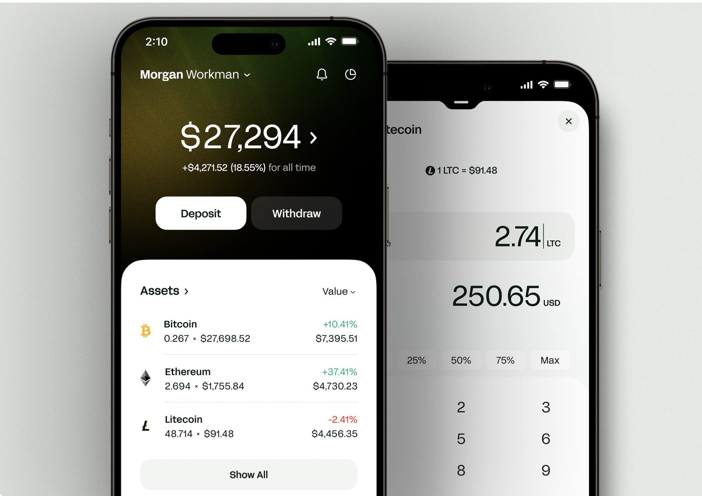
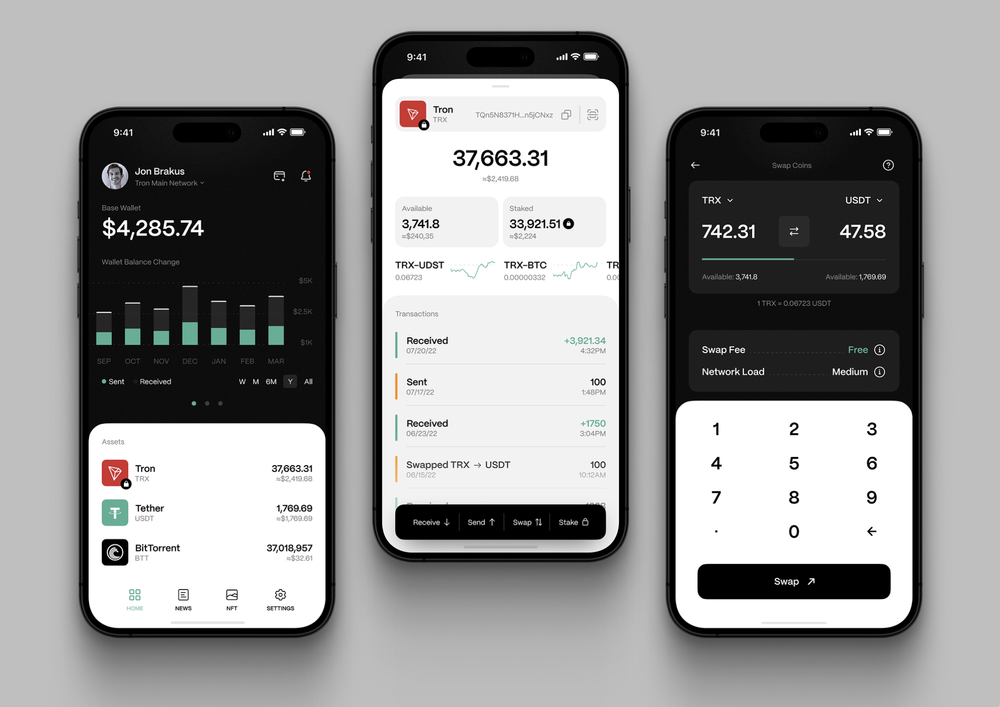

# Pixel Trade

Pixel Trade is a cryptocurrency trading platform designed to simplify and secure trading processes through comprehensive
features like P2P trading, staking, wallet management, and transaction handling. The platform is developed with a focus
on scalability, reliability, and security, utilizing Java and Spring Boot for a reactive and modern application
experience.

## Features

- **P2P Market**: Direct trading between users with an `owner` field for user ownership tracking.
- **Staking**: Admin-controlled staking events and configurations with potential yield generation.
- **Wallet Management**: Multi-currency wallet support and balance tracking with features for locking funds.
- **Transaction Handling**: Fee calculation on transactions with configurable percentage values.
- **NFTs**: Basic functionality for managing non-fungible tokens.
- **Notification System**: Real-time alerts and notifications.
- **Email Verification**: Double-layered email verification with a user-friendly button layout.

## Tech Stack

- **Java**: Core language for backend logic.
- **Spring Boot**: Framework for application configuration and dependency management.
- **Spring Security**: Authentication and authorization support.
- **AWS SDK**: Integration with AWS for storage and compute.
- **PostgreSQL**: Database for structured data storage.
- **Liquibase**: Database migration and version control.
- **OpenFeign**: REST client for external API interactions.
- **Swagger**: API documentation and testing.
- **Freemarker**: Templating engine for email notifications and UI.

## Configuration Highlights

- **GraphQL and REST**: Hybrid project configuration for flexibility in API design.
- **Global Exception Handling**: Consistent error response across APIs.
- **Scheduler**: Periodic data retrieval for cryptocurrency updates.
- **Mail Templates**: Freemarker templates for user-friendly email notifications.

## Future Development

- **Elasticsearch**: Planned integration for enhanced search capabilities.
- **RabbitMQ**: Planned support for asynchronous message handling.

## Requirements

- **Java 17+**
- **PostgreSQL 16+**
- **Maven 3.6+**

